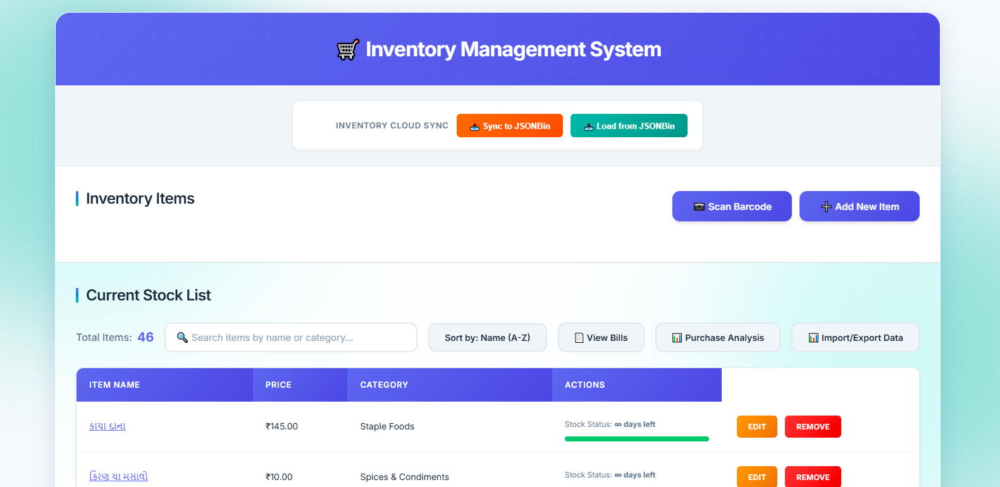
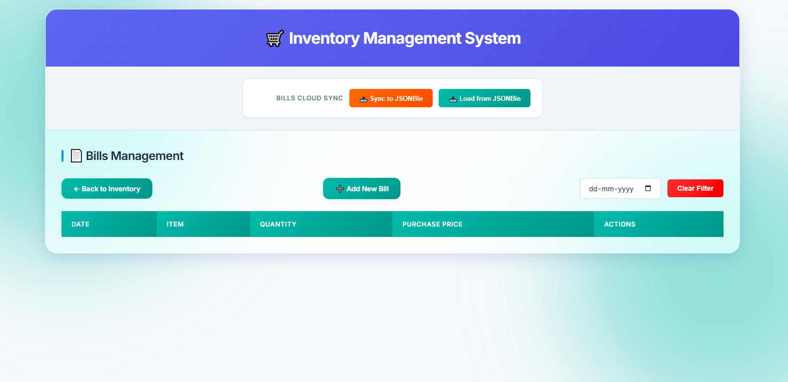

# 🛒 Grocery Inventory Management System

A comprehensive, performance-optimized Progressive Web App (PWA) designed for seamless grocery inventory tracking and purchase analysis. Built with Vanilla JavaScript, this system provides a robust solution for managing household stocks with cloud synchronization and predictive analytics.

🔗 **Repository:** [https://github.com/karanhb-pixel/grocery-inventory-app](https://github.com/karanhb-pixel/grocery-inventory-app)

---

## 📖 Overview

The **Grocery Inventory Management System** is a sophisticated single-page application (SPA) that bridges the gap between simple list-making and complex inventory management. It empowers users to track item stocks, manage bulk purchases, and gain insights into their spending habits and stock longevity through automated "Days Remaining" predictions.

### What makes it special?

- **Zero Dependencies**: Optimized performance using pure Vanilla JavaScript.
- **Offline Ready**: PWA features ensure reliability even without an active internet connection.
- **Cloud Sync**: Integrated with JSONBin.io for multi-device data persistence.
- **Predictive Analytics**: Automated burn-rate calculations to prevent stockouts.
- **Production-Grade**: Addressed critical challenges like data type sanitization and state collision prevention.

---

## 🚀 Key Features

### 🏪 Smart Inventory Management

- **Efficient CRUD Operations**: Add, view, edit, and delete items with ease.
- **Adaptive UI**: Switch between a sortable table view on desktop and a touch-friendly card view on mobile.
- **Quick Filters**: Real-time debounced search by name or category.
- **Granular Categories**: Predefined categories from Staple Foods to Personal Care for better organization.

### 📄 Comprehensive Bills Management

- **Bulk Purchase Tracking**: Record multiple items under a single date with a shared grid interface.
- **Dynamic Price Updates**: Automatically updates item purchase prices upon new entries to track real-time inflation.
- **Historical Comparison**: Compares current prices with previous purchase data.

### 📊 Purchase & Burn-Rate Analysis

- **Frequency Insights**: Track purchase cycles over 7, 30, and 90-day periods.
- **Stock Predictions**: Color-coded alerts predict when items will run out based on current stock and usage patterns.
- **Spending Reports**: Detailed breakdown of average prices and total quantities.

### ⚙️ Data Resilience & Portability

- **JSON/CSV Support**: Full export and import capabilities with robust data validation.
- **Auto-Sync**: Background cloud synchronization with visual status indicators.
- **Manual Backups**: Easy data clearing and restoration options.

---

## 🛠 Tech Stack

**Frontend**

- **Vanilla JavaScript (ES6+)**: Core application logic and state management.
- **CSS3**: Modern, responsive design with glassmorphism effects.
- **HTML5**: Semantic structure and PWA manifest integration.
- **GSAP**: Subtle micro-animations for an enhanced user experience.

**Backend & Storage**

- **JSONBin.io**: Multi-device cloud synchronization.
- **Service Workers**: Offline asset caching and reliability.
- **LocalStorage**: High-speed local cache for instant performance.

**Testing**

- **Jest**: Unit testing for core mathematical logic and data processing.

---

## 🔧 Installation & Setup

1. **Clone the repository:**

   ```bash
   git clone https://github.com/karanhb-pixel/grocery-inventory-app.git
   cd grocery-inventory-app
   ```

2. **Install dependencies (only needed for testing and dev server):**

   ```bash
   npm install
   ```

3. **Configure JSONBin.io (Optional for Cloud Sync):**
   - Sign up at [JSONBin.io](https://jsonbin.io/).
   - Obtain your API Key and Bin IDs.
   - Update `JSONBIN_CONFIG` in `src/services/jsonbin.service.js`.

4. **Launch the app:**
   ```bash
   npm start
   ```
   Navigate to `http://localhost:3000`.

---

## 📸 Screenshots

### Desktop View



### Bills View



### Purchase Analysis View


### Data Management View


### Mobile View


---

## 📝 Author

**Karan**  
_Full Stack Developer | JavaScript Enthusiast_

🔗 Portfolio: [karanhb.com](https://karanhb.com)  
🔗 GitHub: [karanhb-pixel](https://github.com/karanhb-pixel)

---

## 📄 License

This project is licensed under the **ISC** license. See the `package.json` file for details.
